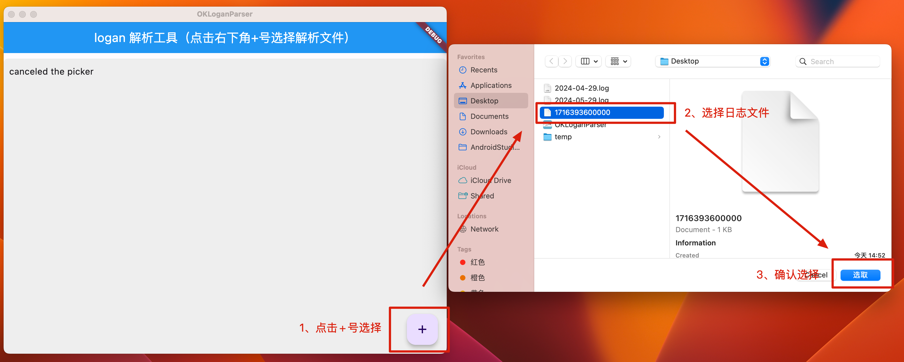
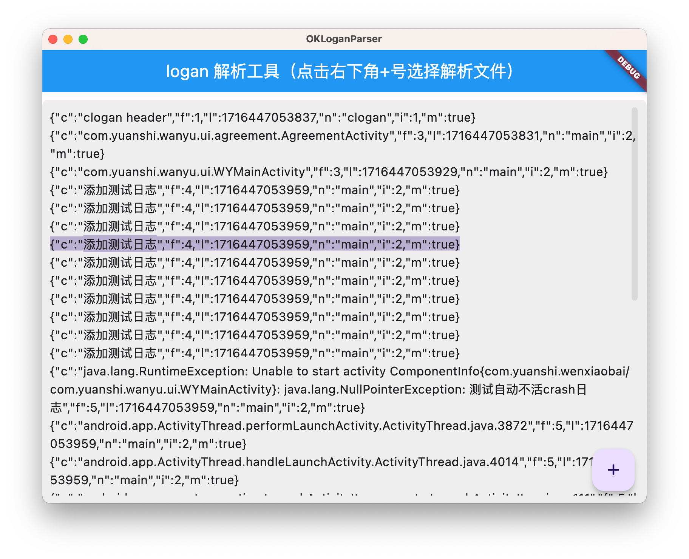

# logan_parser_flutter

基于 Logan 的 Flutter 日志解析工具，用于解析 Android 客户端本地日志文件。


#### 1.4.1 解码方案一：Java工具类

Android SDK未提供相关解码工具类（因为它默认让你接入服务端完成解码）。

下面是通过找到它老版本的LoganParser，并自己实现Java工具类实现解码。

**LoganParser.java**

```java
/*
 * Copyright (c) 2018-present, 美团点评
 *
 * Permission is hereby granted, free of charge, to any person obtaining a copy
 * of this software and associated documentation files (the "Software"), to deal
 * in the Software without restriction, including without limitation the rights
 * to use, copy, modify, merge, publish, distribute, sublicense, and/or sell
 * copies of the Software, and to permit persons to whom the Software is
 * furnished to do so, subject to the following conditions:
 *
 * The above copyright notice and this permission notice shall be included in
 * all copies or substantial portions of the Software.
 *
 * THE SOFTWARE IS PROVIDED "AS IS", WITHOUT WARRANTY OF ANY KIND, EXPRESS OR
 * IMPLIED, INCLUDING BUT NOT LIMITED TO THE WARRANTIES OF MERCHANTABILITY,
 * FITNESS FOR A PARTICULAR PURPOSE AND NONINFRINGEMENT. IN NO EVENT SHALL THE
 * AUTHORS OR COPYRIGHT HOLDERS BE LIABLE FOR ANY CLAIM, DAMAGES OR OTHER
 * LIABILITY, WHETHER IN AN ACTION OF CONTRACT, TORT OR OTHERWISE, ARISING FROM,
 * OUT OF OR IN CONNECTION WITH THE SOFTWARE OR THE USE OR OTHER DEALINGS IN
 * THE SOFTWARE.
 */

import javax.crypto.Cipher;
import javax.crypto.CipherInputStream;
import javax.crypto.NoSuchPaddingException;
import javax.crypto.spec.IvParameterSpec;
import javax.crypto.spec.SecretKeySpec;
import java.io.*;
import java.security.InvalidAlgorithmParameterException;
import java.security.InvalidKeyException;
import java.security.NoSuchAlgorithmException;
import java.util.zip.GZIPInputStream;
import java.util.zip.InflaterInputStream;

public class LoganParser {
    private static final String ALGORITHM = "AES";
    private static final String ALGORITHM_TYPE = "AES/CBC/NoPadding";
    private Cipher mDecryptCipher;
    private byte[] mEncryptKey16; //128位ase加密Key
    private byte[] mEncryptIv16; //128位aes加密IV

    public LoganParser(byte[] encryptKey16, byte[] encryptIv16) {
        mEncryptKey16 = encryptKey16;
        mEncryptIv16 = encryptIv16;
        initEncrypt();
    }

    private void initEncrypt() {
        SecretKeySpec secretKeySpec = new SecretKeySpec(mEncryptKey16, ALGORITHM);
        try {
            mDecryptCipher = Cipher.getInstance(ALGORITHM_TYPE);
            mDecryptCipher.init(Cipher.DECRYPT_MODE, secretKeySpec, new IvParameterSpec(mEncryptIv16));
        } catch (NoSuchAlgorithmException | NoSuchPaddingException | InvalidKeyException | InvalidAlgorithmParameterException e) {
            e.printStackTrace();
        }
    }

    public void parse(InputStream is, OutputStream os) {
        ByteArrayOutputStream bos = new ByteArrayOutputStream();
        byte[] buffer = new byte[1024];
        int t = 0;
        try {
            while ((t = is.read(buffer)) >= 0) {
                bos.write(buffer, 0, t);
                bos.flush();
            }
            byte[] content = bos.toByteArray();
            for (int i = 0; i < content.length; i++) {
                byte start = content[i];
                if (start == '\1') {
                    i++;
                    int length = (content[i] & 0xFF) << 24 |
                            (content[i + 1] & 0xFF) << 16 |
                            (content[i + 2] & 0xFF) << 8 |
                            (content[i + 3] & 0xFF);
                    i += 3;
                    int type;
                    if (length > 0) {
                        int temp = i + length + 1;
                        if (content.length - i - 1 == length) { //异常
                            type = 0;
                        } else if (content.length - i - 1 > length && '\0' == content[temp]) {
                            type = 1;
                        } else if (content.length - i - 1 > length && '\1' == content[temp]) { //异常
                            type = 2;
                        } else {
                            i -= 4;
                            continue;
                        }
                        byte[] dest = new byte[length];
                        System.arraycopy(content, i + 1, dest, 0, length);
                        ByteArrayOutputStream uncompressBytesArray = new ByteArrayOutputStream();
                        InflaterInputStream inflaterOs = null;
                        byte[] uncompressByte;
                        try {
                            uncompressBytesArray.reset();
                            inflaterOs = new GZIPInputStream(new CipherInputStream(new ByteArrayInputStream(dest), mDecryptCipher));
                            int e = 0;
                            while ((e = inflaterOs.read(buffer)) >= 0) {
                                uncompressBytesArray.write(buffer, 0, e);
                            }
                        } catch (Exception e) {
                            e.printStackTrace();
                        }
                        uncompressByte = uncompressBytesArray.toByteArray();
                        uncompressBytesArray.reset();
                        os.write(uncompressByte);
                        if (inflaterOs != null)
                            inflaterOs.close();
                        i += length;
                        if (type == 1) {
                            i++;
                        }
                    }
                }
            }
        } catch (IOException e) {
            e.printStackTrace();
        }
    }
}
```

**ParserUtil.java**

```java
package com.example.myapplication.logan;

import java.io.ByteArrayOutputStream;
import java.io.File;
import java.io.FileInputStream;
import java.io.FileOutputStream;

/**
 * logan解析工具类
 *
 * @noinspection IOStreamConstructor
 */
public class ParserUtil {

    public static void main(String[] args) throws Exception {
        String encryptKey16 = "0123456789012345";
        String encryptIV16 = "0123456789012345";
        LoganParser parser = new LoganParser(encryptKey16.getBytes(), encryptIV16.getBytes());

        //待解码文件位置
        String filePath = "/Users//xxxx/1713888000000";
        File file = new File(filePath);
        ByteArrayOutputStream byteArrayOutputStream = new ByteArrayOutputStream();

        //输出文件
        // String newFilePatch = "/Users/chenfeng/Desktop/2024-04-24.log";
        String newFilePatch = "/Users/xxxx/Desktop/2024-04-25.log";
        File newFile = new File(newFilePatch);
        if (!newFile.exists()) {
            newFile.createNewFile();
        }

        //解析
        parser.parse(new FileInputStream(file), byteArrayOutputStream);

        //存储
        try (FileOutputStream fileOutputStream = new FileOutputStream(newFile)) {
            // 将ByteArrayOutputStream的内容转换为字节数组
            byte[] bytes = byteArrayOutputStream.toByteArray();
            // 将字节数组写入FileOutputStream，即写入文件
            fileOutputStream.write(bytes);
        } catch (Exception e) {
            System.err.println("Error writing to file: " + e.getMessage());
            throw e;
        }

        System.out.println("Good Job!");
    }
}
```

因为官方后端日志存储分析 Server，所以未提供客户端自己的解析方案，暂时使用自己实现的工具类解析。

#### 1.4.2 解码方案二：Flutter工具

（目前只生成了Mac版本。Flutter跨平台特性，若后续Win、Android、iOS等有需要简单适配下也可直接生成工具）

**使用演示：**

1. 选择待解析的Logan日志文件
2. 输入加密密钥（16位）
3. 点击解析按钮
4. 查看解析后的日志内容

**界面展示：**

主界面（选择文件和输入密钥）：


解析结果界面：


**功能特性：**

- 支持选择加密日志文件
- 支持自定义密钥输入
- 解析后显示可读的JSON格式日志
- 支持日志内容搜索和过滤

> **TODO**：密钥开发时忘记了目前写死在代码里了。若后续有需要补充个输入框供外部传。目前能满足需求先这样…